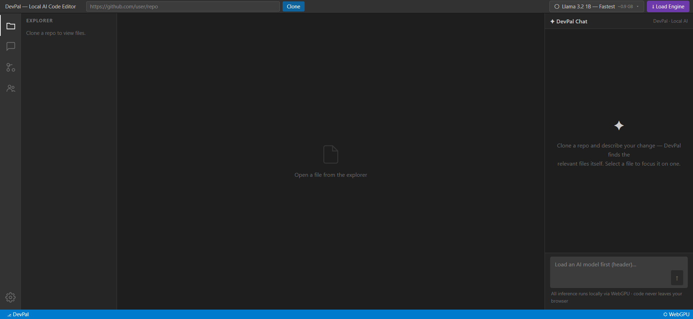
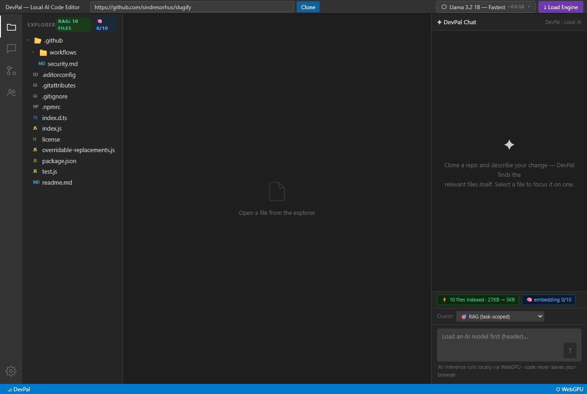
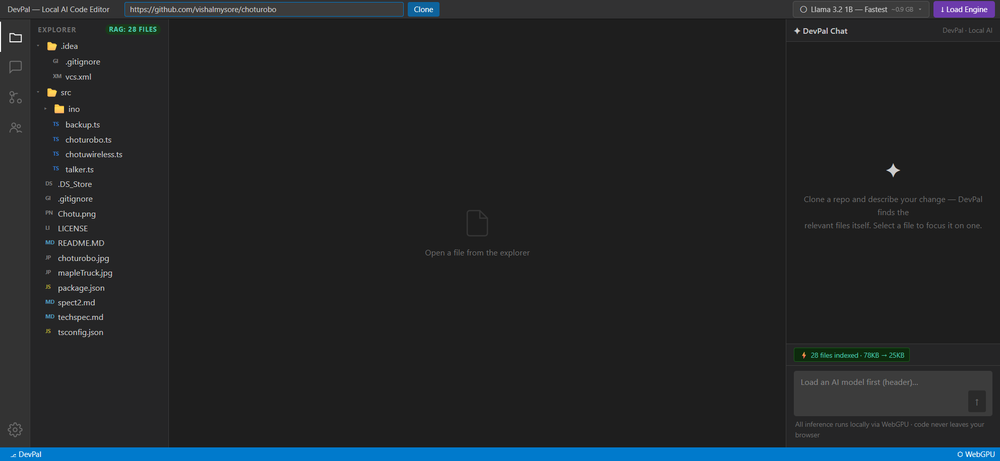
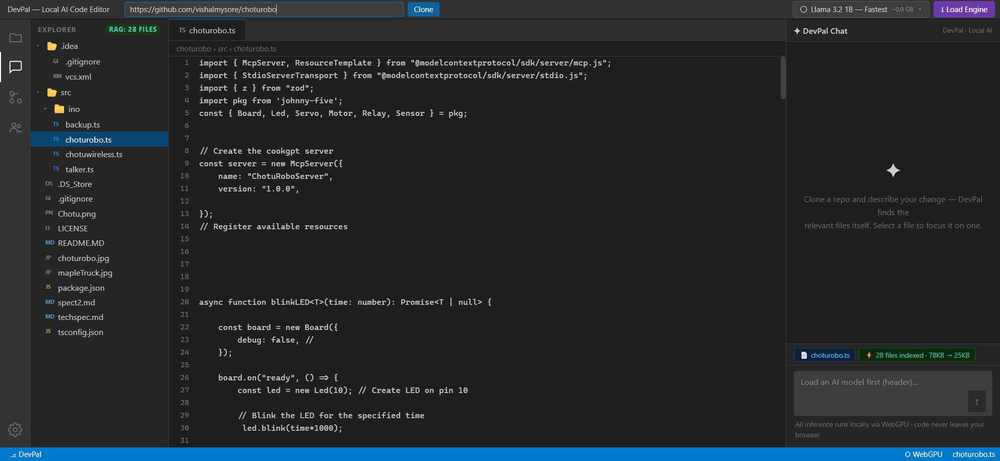
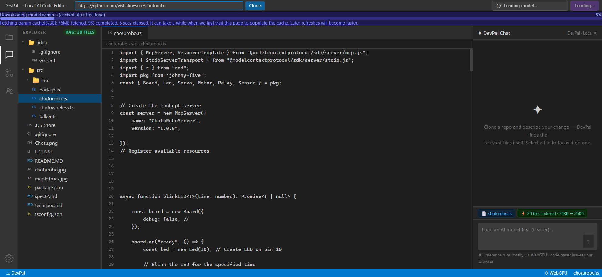
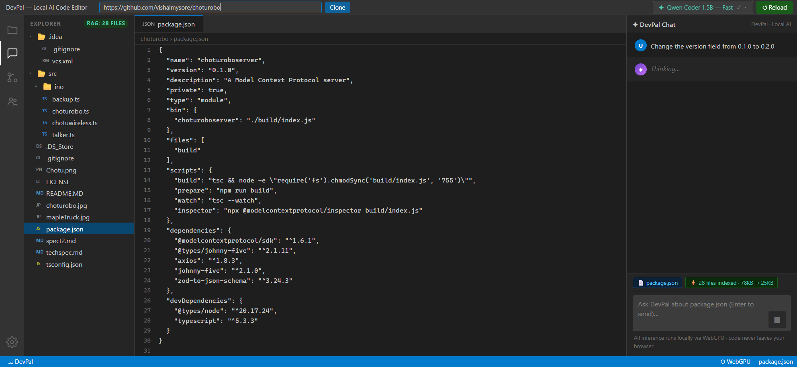
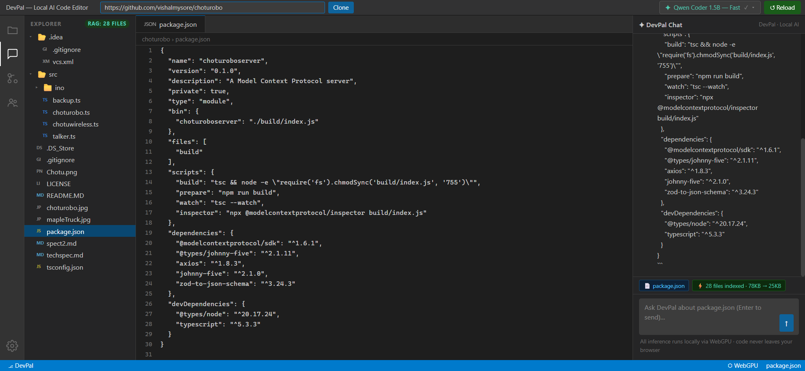
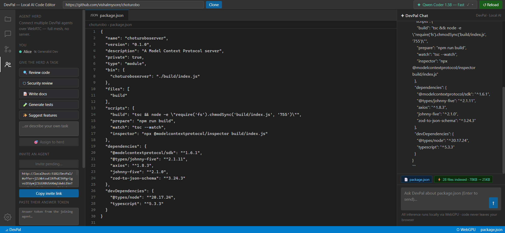

# DevPal: An AI Coding Agent That Runs Entirely in Your Browser

*No server. No API keys. No code ever leaving your machine. A deep dive into a privacy-first coding agent built on WebGPU, isomorphic-git, and WebRTC — plus a full hands-on verification run with screenshots.*

---

## The Idea

Every mainstream AI coding assistant has the same architecture: your code goes up to someone else's GPU, tokens come back down. That is a non-starter for sensitive IP, air-gapped teams, and anyone who simply doesn't want a recurring SaaS bill for autocomplete.

**DevPal** flips the architecture. It is a complete AI coding agent — clone a repo, chat about it, generate patches, review diffs, export `.patch` files — that runs **100% client-side** in a standard Chrome tab:

- **Inference** happens on your own GPU via [WebLLM](https://webllm.mlc.ai/) and WebGPU, inside a dedicated Web Worker.
- **The git workspace** is a virtual file system: [isomorphic-git](https://isomorphic-git.org/) cloning into [LightningFS](https://github.com/isomorphic-git/lightning-fs), which persists to IndexedDB.
- **Codebase awareness** comes from an in-browser RAG pipeline: a code-aware compressor plus hybrid retrieval — lexical TF-IDF blended with semantic similarity from a MiniLM embedding model running in its own worker — now one of four selectable **context-crunch strategies** (RAG, repo map, tree-sitter AST map, local-model summaries) with a live token-savings readout.
- **Multi-agent collaboration** ("Agent Herd") connects several DevPal browsers over serverless WebRTC — full mesh, manual copy-paste signaling, no backend anywhere.

The stack is React 19 + Vite + Tailwind v4, and the whole application is ~2,500 lines of source. It deploys as static files to GitHub Pages: **[vishalmysore.github.io/DevPal](https://vishalmysore.github.io/DevPal/)**.


*First load: activity bar, explorer, chat panel, and a model selector in the title bar. The status bar confirms WebGPU is available.*

---

## Architecture at a Glance

```
[ Title Bar: Repo URL + Clone | Model Selector + Load Engine ]
        │
[ Activity Bar ] ─ [ Explorer / Agent Herd panel ]
        │
[ File Viewer  ⇄  Diff Viewer ] ─ [ DevPal Chat ]
        │
[ Status Bar: WebGPU · repo · file ]

Storage    LightningFS  → IndexedDB       (virtual git workspace)
Inference  WebLLM       → WebGPU          (dedicated Web Worker)
RAG        compressor + TF-IDF + MiniLM   (in-memory index, vectors cached)
Mesh       RTCDataChannel (full mesh)     (no signaling server)
```

Two threads keep the UI responsive: the main thread owns React and the file system; all WebLLM work — weight download, shader compilation, token generation — lives in `src/workers/inference.worker.js` and talks to the UI via `postMessage` status events (`downloading`, `phase`, `token`, `ready`, `error`).

### The git workspace (`src/lib/gitWorkspace.js`)

Each cloned repo gets its own LightningFS namespace backed by IndexedDB. Clones are shallow (`depth: 1, singleBranch: true`) to keep browser storage sane, and are routed through the public `cors.isomorphic-git.org` proxy to satisfy GitHub's CORS policy. The same module exposes `readFile`/`writeFile` (used when you apply a patch) and a `git.walk`-based diff between HEAD and the working directory.

### Code RAG (`src/lib/codeRag.js` + `src/lib/codeCompressor.js`)

After a clone, every text file is indexed:

1. **Code files** run through a regex-based compressor (a JS port of the [headroom](https://github.com/chopratejas/headroom) approach): imports, signatures, class definitions, and decorators are kept; function bodies are stubbed with `... // [N lines omitted]`. Typical reduction is 40–70%.
2. **Text/config files** are chunked by paragraph.
3. On every chat message, retrieval scores all indexed entries against your query and the top hits are injected into the prompt as a "Relevant codebase context" block. Scoring is **hybrid**: normalized TF-IDF (exact term overlap) blended with cosine similarity over sentence embeddings from **all-MiniLM-L6-v2**, which runs in a dedicated WebGPU/WASM worker and catches conceptually-related code that shares no literal tokens. Vectors are cached in IndexedDB keyed by content hash, so re-clones and post-patch re-indexing reuse them — and if the embedder isn't ready yet, retrieval gracefully degrades to pure TF-IDF.

Everything is budgeted against a 4,096-token context window: ~300 tokens reserved for the system prompt, ~1,200 for generation headroom, and the target file is progressively compressed and finally truncated if it still doesn't fit.

### The orchestrator (`src/lib/orchestrator.js`)

DevPal asks the model for structured output rather than freeform code:

```
<<<<<<< SEARCH
[exact lines from the file]
=======
[replacement]
>>>>>>> REPLACE
```

Two modes exist:

- **File mode** (a file is selected): the model patches that one file.
- **Project mode** (no file selected): TF-IDF picks candidate files, the top two are inlined in full, and the model emits `FILE:`-headed patch groups that may span several files.

Applying is deliberately strict: if a SEARCH block doesn't match the file byte-for-byte, `applyPatches` throws and **nothing is written** — the raw model output is shown in chat instead. Accepted patches are rendered side-by-side with diff2html, and can be applied to the virtual FS or downloaded as a standard `.patch` file.

### Agent Herd (`src/lib/peerManager.js`)

The most unusual part. Multiple DevPal instances — different machines, different people, different local models — form a **full-mesh WebRTC network with no signaling server**. One agent mints an invite link (the WebRTC offer, deflate-compressed and base64-encoded into the URL hash); the joiner opens it and sends back an answer token the same way. After that handshake, all traffic is direct peer-to-peer and encrypted.

Once connected, the herd behaves like a tiny distributed team:

- Peers exchange `hello` messages carrying name, **role**, model, and current repo — and automatically clone whatever repo the herd is working on.
- Each agent has a persona (Generalist, Code Reviewer, Security Auditor, Doc Writer, Test Engineer) that is injected into its local model's system prompt.
- A human can assign a **herd task** (one click: "Review code", "Security review", "Write docs", "Generate tests", "Suggest features"); every agent works it from its own role's perspective with its own local model.
- Agents auto-collaborate on each other's tasks with a bounded round counter (4 rounds) so two agents can't ping-pong forever, and proposed patches open directly in every peer's diff viewer.

---

## The Context Cruncher — Four Ways to Shrink a Repo Before It Hits the Model

The single biggest constraint on a browser-local agent is the context window. A 1–1.5B model runs in a **4,096-token** budget; even a hosted agent like Claude Code or Devin bills by the token. So the interesting question isn't "how do we send the repo to the model" — it's **"how little can we send and still be useful?"**

DevPal's original answer was one hard-coded pipeline (compress every file, then hybrid-RAG the relevant ones). That's now just *one* of four selectable **context strategies**, chosen from a **Crunch** dropdown in the chat panel. Every strategy answers the same call and returns the same shape, so they're interchangeable and directly comparable:


*After cloning `sindresorhus/slugify`: the indexer respects `.gitignore` and skips binaries/lockfiles (10 text files, **27 KB → 5 KB**), and the new **Crunch** picker sits right above the prompt box.*

| Strategy | What it sends | Cost |
|---|---|---|
| **🎯 RAG (task-scoped)** | Only the files most relevant to your prompt, compressed — hybrid TF-IDF + MiniLM semantic retrieval | Cheap, prompt-dependent |
| **🗺 Repo map** | A whole-repo signature skeleton: every file's path + its top-level functions/classes/exports (regex-extracted) | Cheap, prompt-independent |
| **🌳 Tree-sitter map** | The same map, but signatures come from a real **AST parse** (12 languages) — accurate multi-line signatures, generics, decorators, nested methods | Cheap, prompt-independent |
| **📝 Model summary** | The local model writes a 2–3 sentence summary of each RAG-selected file (cached per file) | Spends local inferences; the most compact |

Each run reports a live **before/after token badge** — baselined against "the whole repo pasted in raw," which is the honest denominator for the question people actually care about. On this codebase the **repo map crunches ~5,347 tokens of source into 368 tokens — a 93% reduction** — while still telling the model every file that exists and what's callable in it.

### Signatures, done properly

The regex skeleton is fast but naive. The tree-sitter strategy parses the real grammar, so it recovers things a regex can't — the name of an arrow function assigned to a `const`, a class's methods indented under it, a Rust `impl` block, a generic return type. Feeding it a handful of files produces exactly the compact "table of contents" an agent needs to orient itself:

```
### index.js
- export default function slugify(string, options)
- export function slugifyWithCounter()

### a.rs
- pub struct App
- impl App
  - pub fn run(&self) -> Result<()>
- fn helper(x)
```

Getting this working in the browser was the one real fight. `web-tree-sitter` ships as a WASM runtime, and the prebuilt grammar `.wasm` files must match its ABI. The newest runtime (0.26) expects a `dylink.0` section the widely-used `tree-sitter-wasms` grammars don't carry — every grammar load failed with a cryptic `Error: need dylink section`. The fix was to **pin the runtime to 0.20.8** to match the grammars' era, wire the 12 grammar `.wasm` files through Vite's `?url` imports (so they get the correct GitHub-Pages base path and are **lazy-fetched only when a repo actually uses that language**), and fall back to the regex extractor for anything unsupported.


*Switching strategy is one dropdown. The 🌳 Tree-sitter map is selected here; the ~15 MB of grammar assets stay on the shelf until a matching file appears.*

### Learning from the neighbours: repomix and code2prompt

Two excellent tools cover adjacent ground: **[repomix](https://github.com/yamadashy/repomix)** (TypeScript) packs a repo into one AI-friendly file and even does tree-sitter compression via `--compress`; **[code2prompt](https://github.com/mufeedvh/code2prompt)** (Rust) builds a templated prompt from a codebase. Both are Node/CLI tools that walk a real filesystem — neither can run inside a browser tab where DevPal lives. But they validated the approach and pointed at three features worth having, all re-implemented **browser-native**:

- **Real token counts.** The savings badge now uses `gpt-tokenizer` (cl100k BPE, pure JS, lazy-loaded) instead of a 4-chars-per-token guess — so the numbers are a real cost proxy, not a hand-wave. (A quirk worth noting: Vite/rolldown wouldn't resolve the package's `o200k_base` subpath, so DevPal imports the cl100k main entry — still a genuine BPE, and it resolves cleanly.)
- **.gitignore-aware indexing.** A pure-JS `ignore` filter plus a default deny-list keeps `node_modules`, build output, lockfiles, and binaries out of the index — visible in the slugify screenshot above, where the repo's real files index but its noise doesn't.
- **Secret redaction.** A conservative regex pass strips high-confidence credential shapes (AWS keys, GitHub/Slack/Stripe tokens, private-key blocks, JWTs) from the context *before* it reaches the model, and the badge reports how many it caught. On a browser-local agent the code never leaves your machine anyway — but if you export the crunched context to an outside agent, you don't want your keys riding along.

The upshot: DevPal doesn't *port* those tools, it borrows their best ideas and keeps everything in the tab. The tree-sitter compression they pioneered is here; the model-summary strategy is something neither of them has.

---

## Does It Actually Work? A Verification Run

I ran the full pipeline end-to-end on a Windows 11 machine with an **integrated Intel Xe GPU (gen-12lp)** — deliberately modest hardware — using `npm run dev` (Vite 8, port 5182). Summary: **everything works**, with one honest caveat about small-model patch formatting covered below.

### 1. Boot + WebGPU detection ✅

The app loads with zero console errors. The inference worker's guard rail confirmed a real adapter: Intel, `shader-f16` supported, 2 GB max buffer — enough for the 1B–1.5B model tier.

### 2. Clone + RAG indexing ✅

Cloning `https://github.com/vishalmysore/choturobo` (a TypeScript MCP robotics server) through the CORS proxy took a few seconds. The explorer rendered the full tree, and the RAG indexer processed **28 files, compressing 78 KB of source down to 25 KB** (~68% reduction) — visible live in the `RAG: 28 FILES` badge and the green context chip in the chat panel. (This run exercised the TF-IDF retrieval path; the hybrid semantic-embedding retrieval landed on `main` immediately after, and degrades to exactly this behavior while the embedder warms up.)


*After the clone: file tree on the left, and the chat panel now shows "28 files indexed · 78KB → 25KB".*

### 3. File viewer ✅

Clicking any file opens it in a read-only, line-numbered viewer with a VS Code-style tab and breadcrumb.


*The virtual file system is real — this content is being read out of IndexedDB, not from GitHub.*

### 4. Model download + compile ✅

Clicking **↓ Load Engine** streams quantized weights from the MLC CDN with live progress, then compiles WebGPU shaders. On this connection, **Qwen Coder 1.5B went from cold start to ready in 54 seconds**; weights land in the browser's Cache API, so subsequent loads skip the download entirely and the app works offline.


*The indigo banner reports each weight shard as it's fetched — this is WebLLM's init callback surfaced in the UI.*

### 5. Local inference ✅

With a model loaded and a file selected, prompts stream token-by-token from the on-device GPU into the chat panel, with a stop button during generation. The system prompt, compressed file, RAG context block, and task all fit the 4K context budget automatically.


*Qwen Coder 1.5B loaded (✓ in the title bar) and generating. The entire exchange never touches a network.*


*The completed response. The model correctly performed the requested edit (version bump to 0.2.0) in its answer.*

### 6. The patch pipeline ✅ (verified programmatically) — with an honest finding about small models

The SEARCH/REPLACE machinery itself is solid. I unit-tested `orchestrator.js` directly in Node:

- ✔ `parseSearchReplace` extracts blocks from noisy model output
- ✔ `applyPatches` applies them and **rejects non-matching SEARCH text without writing anything**
- ✔ `parseFilePatches` correctly splits multi-file `FILE:`-headed output
- ✔ `generateUnifiedDiff` produces a valid unified diff for the viewer and `.patch` export
- ✔ the compressor stubs a 40-line function body down to a one-line signature + omission marker

The caveat: **models in the 1–1.5B class rarely emit the strict marker format**, even when asked explicitly. In my runs, both Llama 3.2 1B and Qwen Coder 1.5B *understood the task and produced the correct edit* — but wrapped it as a full-file code block instead of `<<<<<<< SEARCH` markers. This matches what the aider project has documented for small models and diff-style formats. DevPal's design handles it exactly as specced: no valid blocks parsed → the output is shown as a plain chat answer, and nothing is written to the workspace. For reliable one-click diffs, use the larger presets — the format was designed around **Qwen Coder 7B** (~4.5 GB, needs 6 GB+ VRAM), with the small models best suited to Q&A, reviews, and guidance.

### 7. Agent Herd ✅

Starting a herd, choosing a role, and minting an invite link all work: ICE candidates are gathered from the configured STUN servers and the offer is compressed into a shareable URL. The role-based task presets light up as soon as a repo is cloned.


*Agent "Alice" online with a pending invite. The one-click herd tasks (Review code, Security review, Write docs, Generate tests, Suggest features) each broadcast to every connected agent.*

---

## Performance Notes (Intel iGPU, no discrete graphics)

| Step | Measured |
|---|---|
| Shallow clone + RAG index (28 files) | ~5 s |
| Qwen Coder 1.5B: cold download → ready | 54 s |
| Model reload from Cache API | seconds (no download) |
| Generation speed | usable but leisurely on an iGPU — a ~30-line file rewrite streamed in ~65 s |
| RAG compression | 78 KB → 25 KB (68%) |

On a machine with a discrete GPU the generation numbers improve dramatically, and the 7B code model becomes practical.

---

## Try It Yourself

```bash
git clone https://github.com/vishalmysore/DevPal.git
cd DevPal
npm install
npm run dev
```

Open `http://localhost:5182/DevPal/` in Chrome 113+ (or use the hosted build at [vishalmysore.github.io/DevPal](https://vishalmysore.github.io/DevPal/)). Then:

1. **Load the engine** — pick a model in the title bar and click ↓ Load Engine (one-time download, cached after).
2. **Clone** any public GitHub repo.
3. **Chat** — with a file selected, DevPal patches that file; with none selected, RAG picks the targets across the whole repo.
4. **Review** the side-by-side diff, then ✓ Apply it to the virtual workspace or ↓ export a standard `.patch`.
5. Optional: open **Agent Herd**, invite a friend's browser, and give the herd a task.

---

## What I'd Build Next

- **A "whole file" fallback format** for small models: since the 1–1.5B tier reliably produces correct *content* but not marker syntax, accepting a fenced full-file response (and diffing it against the original) would make one-click patches work even on the fastest models.
- **Syntax highlighting** in the file viewer (the diff viewer already has it via diff2html).
- **Commit support** — isomorphic-git can already commit to the virtual workspace; surfacing `git.walk`'s diff in the Source Control panel would complete the loop.
- **A user-supplied CORS proxy setting** for teams that don't want to route clone traffic through the public proxy.
- **An "export context pack" button** — run any crunch strategy over a repo and download the result as a single Markdown/XML file to hand to an external agent (Claude Code, Devin), turning DevPal into a token-budget prep tool as well as a local agent.

---

## Closing Thought

The most interesting thing about DevPal isn't any single library — it's that the browser quietly became a complete platform for this. A GPU inference runtime, a POSIX-ish file system, a full git implementation, and encrypted peer-to-peer networking are all standard web APIs now. "Serverless" usually means *someone else's server*. Here it means **no server at all**.

*DevPal is Apache 2.0 licensed. The code-aware compressor is inspired by [headroom](https://github.com/chopratejas/headroom).*
